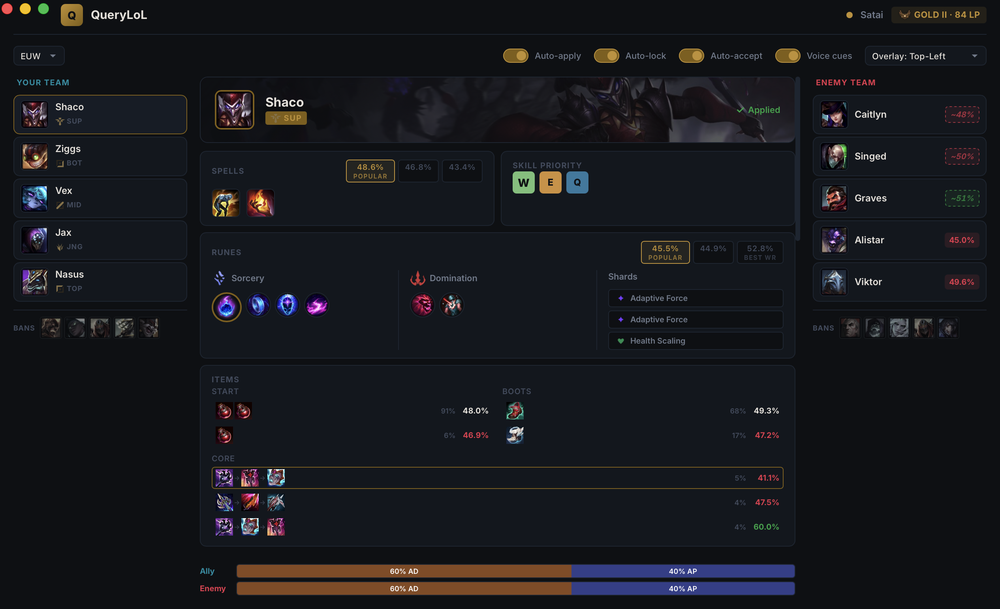
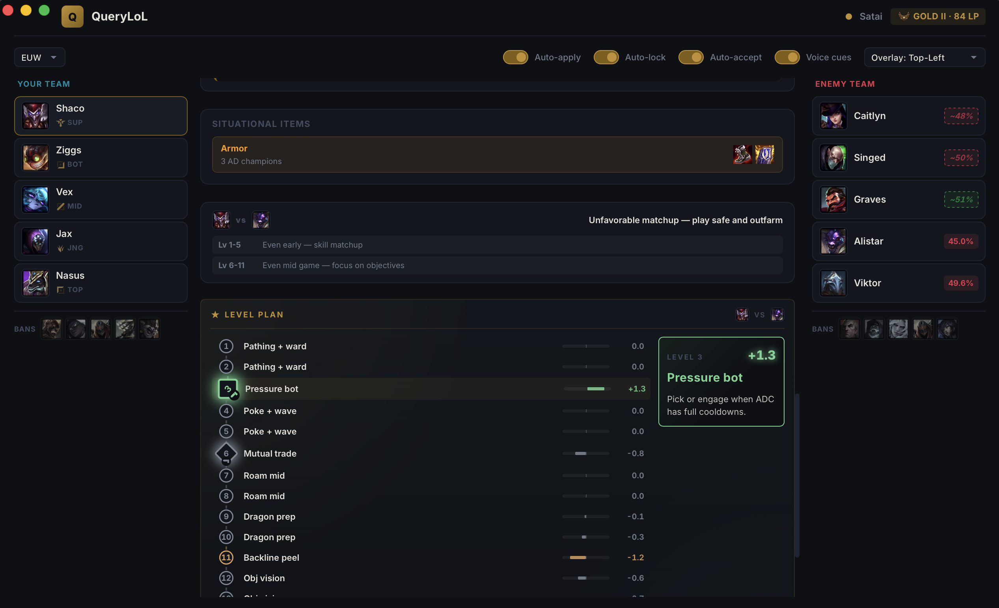
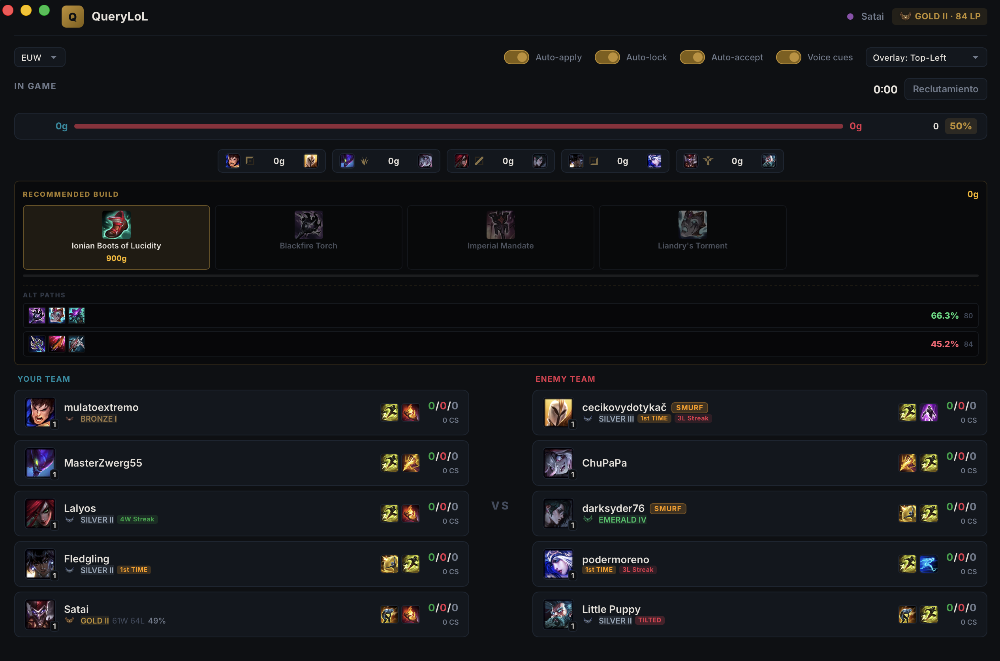
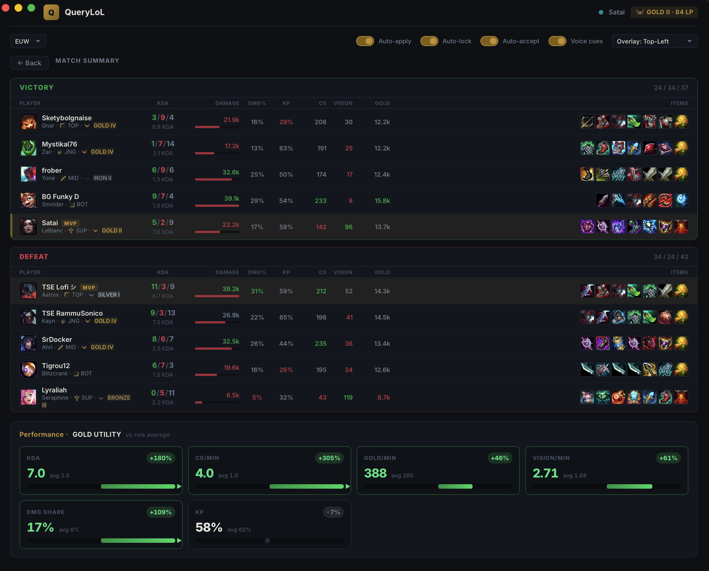
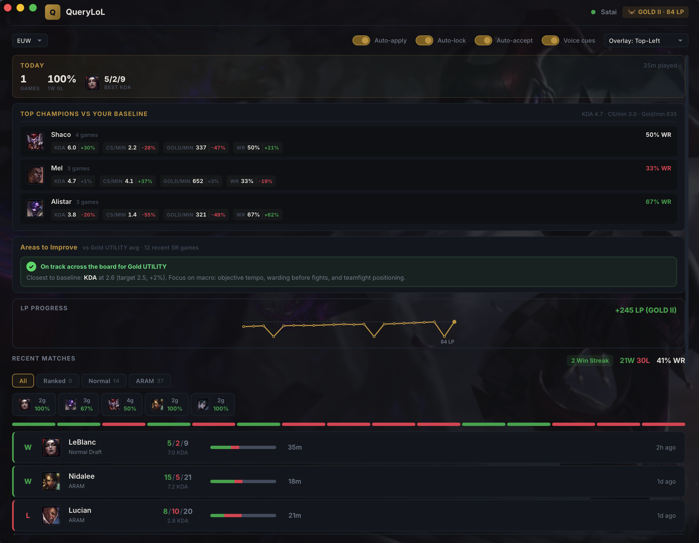

# QueryLoL Desktop

A desktop companion app for League of Legends that auto-configures optimal builds, provides counter-based pick/ban suggestions, real-time in-game tracking, and post-game analysis — all in real time.

Built with **Tauri** (Rust) + **React** (TypeScript). Lightweight (~15MB), no Overwolf, no Electron.

**🌐 Website:** https://ishtartec.github.io/query-lol-desktop/ · **⬇️ [Download latest release](https://github.com/ishtartec/query-lol-desktop/releases/latest)**

---

## Screenshots

### Champion Select — Builds & Damage Composition
Auto-applied runes, spells, and item set the moment you pick, with per-team AD/AP damage composition bars and enemy matchup win rates.



### Level-by-Level Plan
An 18-level timeline vs your lane opponent — per-level advantage from power curves, spike bonuses, and ult-strength, plus situational items and matchup notes.



### Live Game
Real-time recommended build, win probability, gold diff, and a full scoreboard with player ranks, OTP / first-time / smurf labels.



### Post-Game Analysis
Full match scoreboard for both teams — damage, KP, CS, vision and gold per player — plus a role-adjusted performance breakdown (here vs Gold UTILITY) across KDA, CS/min, gold/min, damage share, vision/min and kill participation.



### Home Dashboard
Today's recap, your top champions vs your own baseline, role-aware areas to improve (benchmarked against your rank and detected position), LP progress, and recent match history.



---

## Features

### Auto-Detection & Connection
- Automatically detects the League of Legends client via LCU (League Client Update)
- **Windows and macOS** support with automatic lockfile and process detection
- Displays summoner name, ranked tier, rank, and LP on connection
- Supports 11 regions: EUW, NA, KR, EUNE, BR, LAS, LAN, OCE, TR, RU, JP
- Persistent configuration saved to disk (region, toggles, LP history)

### Champion Select — Builds
- Fetches optimal builds from OP.GG the moment you pick a champion
- **Auto-apply runes** — writes a full rune page (primary tree, secondary tree, stat shards)
- **Auto-apply summoner spells** — sets the recommended spell pair
- **Auto-apply item sets** — creates a custom item set with starter items, boots, and core build
- **Alternative builds** — up to 3 options per category (runes, spells, items) with win rate and pick rate, switchable via tabs
- **Skill order** — color-coded priority (Q/W/E/R) plus the full level-by-level order for levels 1-15, with evolution badges on the levels where champions like Kha'Zix pick one
- **Ability details** — hover any skill pip for that ability's in-game preview clip, name, description, and per-rank cooldown / cost / range
- **Item & rune tooltips** — hover any icon to see name, description, and gold cost
- Manual "Apply" button when auto-apply is disabled

### Champion Select — Drafting Intelligence
- **Pick recommendations** — scrollable carousel of suggested champions scored 0-100, factoring in enemy counters, ally synergies, and meta strength
- **Ban suggestions** — top ban candidates for your position with win rate and pick rate, one-click ban
- **Matchup win rates** — per-enemy win rate badges (green = favorable, red = unfavorable). Falls back to a curve-based estimate (italic, dashed border, `~XX%`) when OP.GG has no per-matchup data
- **Team composition callouts** — analyzes your team's traits (engage / frontline / peel / scaling / burst) and surfaces strengths and gaps as color-coded callouts
- **All-lanes matchup prediction** — per-position FAVORED/EVEN/UNFAVORED verdict for every ally-vs-enemy pairing with early/late game deltas
- **Trinket recommendation** — yellow / sweeping / blue ward suggested by your role + invisible threats + ranged poke detection
- **Build style labels** — runes/spells/items alternative tabs labeled `Popular` (highest pick rate) or `Best WR` (highest win rate) so you can pick by style
- **Ward placement tips** — timeline of suggested ward spots (0:30, 3:00, 5:30…) for your role, adjusted by the enemy jungler's archetype (ganker / farmer / invader)
- **Matchup analysis by level** — phase-by-phase power comparison (early/mid/late) with actionable tips like "avoid trades level 1-3" or "power spike at level 6"
- **Level-by-level plan** — 18-level timeline vs your lane opponent with a contextual action per level (e.g. "Lvl 3 trade", "All-in con R", "Farm lado opuesto", "R2 + obj"). Calculates per-level advantage from power curves + spike bonuses + ult-strength comparison, with hexagonal nodes pulsing on spike levels and color-coded categories (dominant / strong / even / careful / weak). Full coverage for all 172 champions. Hover any level to see a coach-style tip in the detail card
- **Damage composition** — AD/AP split bar for both teams, with warnings for heavy one-type compositions
- **Adaptive item recommendations** — situational items based on enemy comp (antiheal, MR stacking, armor, anti-shield) with champion-specific reasoning
- **Game prediction** — team-vs-team analysis with early/late game phase scores and a strategy tip
- **One-click pick/ban** — click any recommendation or ban suggestion to lock it in
- **Auto-lock** — optionally auto-lock your champion selection
- **Full draft visualization** — ally/enemy picks, bans, and positions with role icons displayed in a 3-column layout
- **ARAM bench** — shows available bench champions sorted by ARAM win rate, click to swap

### Lobby
- **Daily summary** — games played today, W/L, winrate, current streak, LP net, best KDA of the day, and total time played. Time turns yellow >3h and red >5h with a "consider a break" hint
- **Tilt gate** — after 3+ ranked losses in under 2 hours, a soft banner shows your personal historic winrate after a 3-loss streak (e.g. "drops from 48% to 31%") to encourage a break
- **Champion-specific improvement** — for your top 3 most-played champions, compares KDA / CS-min / Gold-min / Winrate against your overall baseline with color-coded deltas (≥+5% green, ≤-5% red)
- **Improvement priorities** — top 3 areas to improve based on your ranked history vs elo benchmarks, with visual bars and actionable advice
- **Match history** — recent games with champion icon, result, KDA, duration, and relative timestamps
- **Mode filters** — filter by All, Ranked, Normal, or ARAM
- **Champion filter** — filter match history by your top 5 most-played champions
- **Win/loss stats** — win rate percentage and current win/loss streak detection
- **LP progress chart** — SVG line chart tracking LP changes over time (up to 50 data points) with bezier curves and color-coded gains/losses
- **Champion stats bar** — top 5 champions by games played with win rate badges
- **Hero splash background** — dynamic background using your most-played champion's splash art

### Live Game
- **Team compositions** — blue vs red side with champion icons and summoner names, sorted by lane (top → jungle → mid → bot → support)
- **Player ranks** — rank emblems and tier text for every player in the match
- **Player labels** — automatic badges: OTP, Autofill/1st Time, Win Streak, Loss Streak, Tilted, High WR
- **Ranked stats** — W/L record, win rate, and current win/loss streak
- **Champion proficiency** — games played, win rate, and KDA on the picked champion
- **Smurf detection** — automatic analysis of enemy accounts using account level, win rate, games played, KDA, and champion diversity to flag likely smurfs with a 0-100 confidence score
- **Real-time scoreboard** — live KDA, CS, level, and current items for all players (via Live Client Data API)
- **Gold tracker** — team gold bar with total gold comparison (unspent + item value)
- **Lane matchup gold diff** — per-position gold comparison between matched lane opponents
- **Summoner spell display** — all 10 players show their summoner spells (Flash, Ignite, TP, etc.). Localized LoL clients supported via internal spell-key matching
- **Spell cooldown tracker** — click enemy summoner spells to start countdown timers (Flash 5:00, TP 6:00, etc.), click again to cancel
- **Power spike alerts** — "Enemy completed [item]" when enemies buy key items
- **Real-time recommended build panel** — full build sequence (boots + 4 core items) with owned/next/future states, conic-gradient progress ring on the next item, gold-needed counter, and a "READY" pulse when affordable. The same strip is mirrored compactly in the overlay
- **Threat-response suggestion** — after 8:00 game time, weighs each enemy's threat (KDA × level × gold-vs-baseline) and surfaces one situational defensive item per role (Maw, Force of Nature, Randuin's Omen, Mercury's Treads, Mortal Reminder…). All five branches — antiheal, magic resist, armor, tenacity, anti-shield — are scored by what share of the enemy team the threat represents and the strongest wins, so the advice tracks the game instead of always landing on the same item. Skips the suggestion when you already own coverage
- **Penetration advisor** — reads the enemy team's *actual* resistances (champion base + level growth + the magic resist / armor on the items they are holding right now) and tells you exactly how much damage a penetration item would unlock: `Void Staff +23% dmg · 3 enemies stacking MR · avg MR 92 absorbs 48% of your damage`. The figure is arithmetic, not a guess — the `100/(100+R)` multiplier does not depend on ability ratios. Shown in the main window and as a badge on the overlay build strip
- **Anti-shield hint** — separate from the threat item, because Serpent's Fang counters a mechanic rather than replacing a resistance. Fires when two or more enemies are actively enabling (shielding allies while building utility rather than damage, read from their live items)
- **Build alternatives with WR labels** — top-3 alternative core paths (≥50 games), sorted by WR%, with item icons + game count. Hides the path that matches your current recommendation
- **Objective timers** — Baron buff (3:00), Elder Dragon buff (2:30), and Dragon Soul tracking with countdown and team indicator
- **Objective spawn windows** — Drake / Voidgrubs / Herald / Baron next-spawn chips when ≤90s, urgent pulse at ≤30s, dashed border indicating the team that took the last instance. Season 2026 timings (Drake 5:00, Voidgrubs 8:00 single, Herald 15:00 single, Baron 20:00 with 6:00 respawn)
- **Objective feed** — dragons, baron, herald, turrets, inhibitors, and multikills with timestamps
- **Win probability** — real-time win % estimate based on gold diff, game time, dragons, and baron (displayed in gold bar and overlay)
- **Roam / missing tracker** — detects when an enemy laner has stopped farming (CS hasn't progressed in ~25s and they're not dead). Shows `⚠ TOP MIA 0:32` badge in the overlay with a live countdown
- **Death timer prediction** — when an enemy dies, computes expected respawn from the official BRW table per level + post-15min time factor. Shows `💀 MID 28s` countdown until they're back
- **Recall optimizer** — checks your current gold against the next reachable item from your build. Shows `1300g Lost Chapter` or pulses gold with `B Lost Chapter` when you can afford it
- **Wave state advisor** — during lane phase, recommends an action based on your CS diff vs lane opponent: *Push prio · roam* / *Push wave* / *Hold wave* / *Last-hit safe* / *Freeze cerca torre*
- **Enemy jungle tracker** — infers jungler activity from kill/assist/death events. Shows `JGL: farmeando` / `JGL: posible gank o obj` / `JGL: obj/invadiendo` based on time since last seen + game minute heuristics
- **Vision target advisor** — compares your ward score against the Gold-elo benchmark for your role (SUP 1.5/min, JNG 0.9/min, others 0.6/min). Soft red warning when you're <70% of target
- **Voice cues (TTS)** — optional audio alerts for time-critical events that you can't see in the visual overlay during play. Uses macOS `say` (Samantha voice) or Windows SAPI (en-US). Toggle from the toolbar. Currently speaks:
  - *"Caitlyn missing"* when an enemy laner has been MIA ≥8s (45s cooldown per enemy)
  - *"Caitlyn completed Wit's End"* when an enemy buys a ≥2500g item (60s cooldown per item)
  - *"Recall ready, Lost Chapter"* when you can afford a key item (90s cooldown)
  - *"Watch for ganks, jungla rotando"* on jungle activity transitions
  - *"Enemy jungla unknown, place wards"* when the jungler hasn't been seen for ≥60s (90s cooldown)
  - *"Place wards"* every 3 minutes if your vision score is <50% of target
  - *"Drake spawning in 30 seconds, enemy jungler unseen 50 seconds"* — once per spawn instance for Drake / Voidgrubs / Herald / Baron, with jungler-context injection
- **In-game overlay** — hold TAB to show a compact overlay with all the above plus win probability, lane gold diffs, objective timers, and a **5-level plan preview** (current level + next 4 with actions, advantage, and spike warnings). Borderless windowed mode, configurable position
- **Player profiles** — click any player to view their match history in an overlay

### Post-Game Analysis
- **Full scoreboard** — all 10 players with comprehensive stats and position icons
- **KDA** — kills, deaths, assists with computed KDA ratio (or "Perfect" for 0 deaths)
- **Damage & damage share** — total damage with proportional bar, damage percentage of team total
- **Kill participation** — percentage of team kills involved in
- **CS & vision score** — with ward placement and ward kill breakdown on hover
- **Gold earned** — formatted with "k" suffix
- **Performance highlighting** — stats color-coded green (>115% of team avg) or red (<85% of team avg)
- **MVP badge** — awarded to the top performer based on a composite score
- **Multikill badges** — triple, quadra, and penta kill indicators
- **Final items** — complete end-game item build for each player with tooltips
- **Gold advantage timeline** — SVG chart of gold diff over time with a win probability curve overlaid, a labelled gold axis, and final / peak / win% figures in the header. Hover any point for the exact gold diff and win chance at that minute; death markers name the champion and the gold swing around their death. Works for any match in your history, not only games the app watched live
- **Elo comparison** — your CS/min, vision/min, KDA, damage share, KP, and gold/min compared against your rank's average with percentage deltas
- **Performance by phase** — CS/min, gold/min, and KDA broken down by early (0-14m), mid (14-25m), and late (25m+) game phases
- **Damage profile** — two cards: what you dealt (physical / magic / true split, the enemy team's real resistances, and how much of your damage they absorbed after your own penetration) and what you took (the incoming split, your finished armor and MR, total mitigated). Flags a genuine mismatch, e.g. 92% magic damage into a team averaging 190 MR with no penetration bought — and stays quiet when you are not the damage source
- **Player profiles** — click any player name to view their ranked info and match history

### Ready Check
- **Auto-accept** — automatically accepts the ready check when a match is found

### Settings (Toolbar)
- Region selector
- Auto-apply toggle
- Auto-lock toggle
- Auto-accept toggle
- Voice cues toggle (TTS audio alerts during the game)
- Overlay position selector (Off / Top-Left / Top-Right / Bottom-Left / Bottom-Right / Center)
- All settings persisted across sessions

### Auto-Update
- Checks for new versions on startup via GitHub Releases
- One-click update & restart from an in-app banner

---

## Download & Install

Pre-built binaries for **Windows** (.exe) and **macOS** (.dmg) are available from the [Releases](../../releases/latest) page.

### Windows

1. Download the `.exe` installer from the latest release
2. Run the installer — Windows SmartScreen will show a warning because the app is not code-signed yet
3. Click **"More info"** → **"Run anyway"** to proceed with the installation
4. Launch QueryLoL from the Start Menu or desktop shortcut
5. Set League of Legends to **Borderless** display mode (Settings → Video) for the in-game overlay to work

### macOS

1. Download the `.dmg` from the latest release
2. Open the DMG and drag QueryLoL to Applications
3. On first launch, macOS may block the app. If you see "app is damaged", open Terminal and run:
   ```bash
   xattr -cr /Applications/QueryLoL.app
   ```
4. Open QueryLoL from Applications

### In-Game Overlay

During a match, hold **TAB** to show a compact overlay with gold diff, enemy KDA/items/spells, and objective timers. The overlay position can be configured from the toolbar dropdown (Top-Left, Top-Right, Bottom-Left, Bottom-Right, Center, or Off). Requires **Borderless** display mode in League of Legends.

---

## Tech Stack

| Layer | Technology |
|-------|-----------|
| Desktop runtime | [Tauri 2](https://tauri.app/) (Rust) |
| Frontend | React 19 + TypeScript |
| Build tool | Vite 7 |
| HTTP client | Reqwest (Rust) |
| Async runtime | Tokio (Rust) |
| Serialization | Serde (Rust) |

### Data Sources
- **Riot LCU** — local League client API for game state, summoner info, applying builds, match history
- **Riot Live Client Data** — real-time in-game stats (port 2999): KDA, CS, gold, items, game events
- **OP.GG API** — champion builds, counters, win rates, ban suggestions, pick recommendations, game predictions
- **Data Dragon** (Riot CDN) — champion/item/rune/spell metadata, icons, and descriptions
- **CommunityDragon** — rank emblems, stat shard icons, position icons

---

## Getting Started

### Prerequisites
- [Node.js 22](https://nodejs.org/) (current active LTS — ships with corepack)
- [Rust](https://www.rust-lang.org/tools/install)
- [Tauri prerequisites](https://tauri.app/start/prerequisites/)

`pnpm` is managed automatically via [corepack](https://nodejs.org/api/corepack.html) — the version is pinned in `package.json` (`packageManager` field). Enable it once:

```bash
corepack enable
```

### Development

```bash
# Install dependencies (corepack auto-pulls the pinned pnpm version)
pnpm install

# Run in development mode (launches Tauri + Vite dev server)
pnpm tauri dev
```

### Build

```bash
# Build for production
pnpm tauri build
```

### Release

```bash
# Bump version, commit, tag, and push (triggers CI build + GitHub Release)
./scripts/release.sh 0.14.0
```

---

## How It Works

1. **Watcher loop** — the Rust backend continuously polls for the League client process. Once detected, it reads the LCU lockfile to establish a connection.
2. **Phase detection** — polls the game phase every second (lobby, champ select, in-game, post-game) and reacts to transitions.
3. **Build fetching** — when you pick a champion in champ select, it fetches the optimal build from OP.GG for your champion + position + region.
4. **Auto-apply** — writes runes, summoner spells, and item sets directly to the League client via LCU endpoints.
5. **Draft analysis** — as enemies are revealed, it calculates matchup win rates, power curves, damage composition, generates pick/ban recommendations, adaptive item suggestions, a game prediction, and an 18-level action plan against your lane opponent (combining interpolated power curves, per-champion spike levels, and ult-strength comparison).
6. **Live game data** — during a match, polls the Live Client Data API (port 2999) every second for real-time KDA, CS, gold, items, ward score, and game events. Records snapshots every 30s for post-game phase analysis.
7. **Live coaching engine** — heuristics derived from the polled data:
   - **MIA detection**: a laner whose CS hasn't increased in 25s and who isn't recently dead is flagged as missing.
   - **Death timer**: official BRW (base respawn wait) table by level × post-15min time factor for accurate countdowns.
   - **Recall optimizer**: compares current gold against the next unowned item from your fetched OP.GG build.
   - **Jungle inference**: tracks kill/assist/death events involving the enemy jungler and combines with game-time heuristics (first clear, scuttle, drake/herald windows) to label their likely activity.
   - **Vision benchmarks**: ward-score comparisons against role-specific Gold-elo averages.
8. **Voice cues** — `say` on macOS or Windows SAPI for time-critical audio alerts (missing enemies, enemy item completions, recall ready, jungle rotations, vision reminders). Throttled with per-event cooldowns.
9. **Overlay** — a second transparent window (hold TAB) shows compact live game info on top of the game (Windows borderless windowed).
10. **Post-game analysis** — computes gold timeline, death impacts, per-phase stats, and elo comparison from collected snapshots.
11. **State sync** — the backend emits `app-state-changed` events to the React frontend, which re-renders reactively.

---

## Disclaimer

QueryLoL Desktop is not endorsed by Riot Games and does not reflect the views or opinions of Riot Games or anyone officially involved in producing or managing Riot Games properties. Riot Games and all associated properties are trademarks or registered trademarks of Riot Games, Inc.

## License

[MIT](LICENSE)
